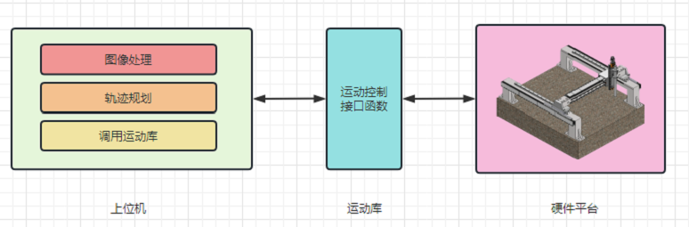

# WriteRobot（写字机器人上位机）
本项目使用C# WinFrom开发，预期功能实现基于现有平台写字。

实现思路如下，上位机负责图像处理， 生成运动轨迹，调用封装的运动库函数来驱动现有平台写字。如果要适配其它运动平台，只需要按照运动库风格封装（连接、断开、运动到指定点、运动到位）等函数即可。

## TO-DO
- [ ] 上位机界面设计
- [ ] 引入opencv进行图像预处理
- [ ] 轨迹规划（运动、抬笔、落笔）
